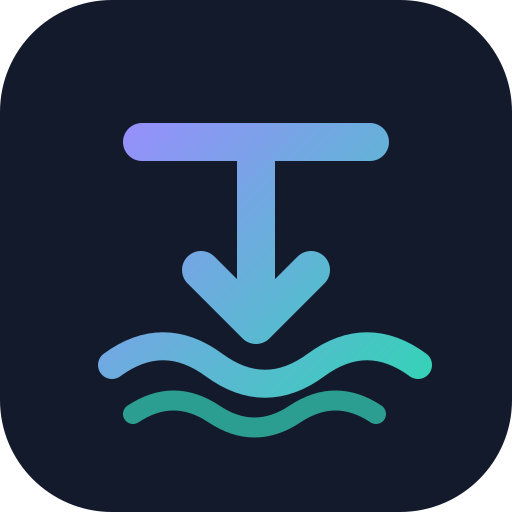

<h1>
  
  Torrential
</h1>

Torrential turns a collection of media-management applications into one deployable,
ready-to-use TV and movie acquisition stack. It removes the repetitive work of
installing each service separately, connecting them to one another, and remembering
where every interface lives.

It does four things:

- brings the \*arr applications and their supporting services together in one Docker
  Compose deployment;
- automatically prepares storage and configures the services to work together,
  including Transmission, Plex, Seerr, download paths, libraries, and notifications;
- provides a local dashboard with links to every user-facing interface, Docker
  health and uptime, and allowlisted restart controls;
- forces public egress from the privacy-sensitive Transmission, Prowlarr, and Byparr
  services through the configured VPN, with a fail-closed firewall that prevents
  fallback to the host's normal internet connection.

Once running, Seerr is the main place to discover and request TV shows and movies.
Sonarr and Radarr manage acquisition and organization, Prowlarr supplies their
operator-selected indexers, Transmission performs downloads through the VPN, and
Plex serves the completed media.

| Service | Responsibility |
| --- | --- |
| Dashboard | Local launcher with Docker health, uptime, and restart controls |
| [Seerr](https://docs.seerr.dev/) | Unified discovery and request interface |
| [Sonarr](https://sonarr.tv/) | TV acquisition, monitoring, import, and naming |
| [Radarr](https://radarr.video/) | Movie acquisition, monitoring, import, and naming |
| [Prowlarr](https://prowlarr.com/) | Indexer management and synchronization |
| [Byparr](https://github.com/ThePhaseless/Byparr) | Best-effort browser-challenge proxy for affected indexers |
| [Transmission](https://transmissionbt.com/) | BitTorrent downloads |
| [Plex Media Server](https://www.plex.tv/media-server-downloads/) | Media libraries and playback |
| [Gluetun](https://github.com/qdm12/gluetun) | Required VPN routing and kill switch for Transmission, Prowlarr, and Byparr |
| Bootstrap | Host-directory preparation, Plex authorization, and idempotent stack configuration |
| Controller | Allowlisted Docker status and restart operations for the dashboard |

Use Torrential only with content and sources you are legally authorized to access.

## Quick start

Docker Desktop, or Docker Engine with Docker Compose 2.20.0 or newer, is required.

```sh
cp .env.example .env
```

Edit `.env`, select a Gluetun VPN provider, and set its OpenVPN credentials. VPN
routing is mandatory: Compose refuses to render without credentials, and the routed
services cannot start until Gluetun is healthy.

`TZ` controls clocks and `LOCALE` controls language and regional media defaults.
The example uses `Europe/London` and `en-GB`.

Set `TORRENTIAL_HOST` in `.env` to the Docker host's stable LAN IP address or local
DNS name, without a scheme or port. Torrential uses it for Plex's advertised server
URL and the dashboard completion banner. `DASHBOARD_PORT` and `PLEX_PORT` are applied
automatically.

Start the stack:

```sh
docker compose up -d
docker compose logs --follow bootstrap
```

Compose downloads missing service images, including Torrential's small prebuilt Go
runtime image.

On a fresh deployment, bootstrap prints one Plex authorization URL in its log and
waits. Open it, sign in to Plex, and approve Torrential. Bootstrap
uses that single authorization to claim Plex and create Seerr's administrator; there
is no token to copy or store. Follow the terminal output after approval. Subsequent
starts do not prompt again.

Open the dashboard URL printed in the completion banner. It provides links to all six
service interfaces, using whichever hostname or IP address opened the dashboard and
each service's configured port. Every card reports Docker health and uptime and can
restart that service. The stack restart control restarts only the runtime services in
dependency order; it leaves the dashboard, controller, and completed one-shot setup
containers alone.

Bootstrap creates the shared data directories, configures Transmission, connects the
manager and indexer services, creates the Plex libraries, and configures Seerr with
Plex, Sonarr, and Radarr. It also configures Sonarr and Radarr to ask Plex to scan
the relevant library after imports and upgrades. Sonarr, Radarr, Prowlarr, and
Transmission require no separate sign-in and are intended only for a trusted local
network. Indexer selection remains an operator decision. Follow
[Deployment and setup](docs/deployment.md).

Persistent state is stored under `./state` by default and excluded from Git.
Stop and remove the containers with `docker compose down`. After onboarding,
`docker compose up -d` starts them in the background.

## Development

Project-owned runtime code consists of the static HTML, CSS, and JavaScript dashboard
in `dashboard/` and one standard-library Go program in `bootstrap/`. The Go image
runs in separate filesystem-preparation, configuration-bootstrap, and long-running
controller modes.

```sh
cd bootstrap
go test ./...
go build ./...
```

Use `compose.dev.yaml` to build and exercise bootstrap changes locally. Production
deployments use the versioned multi-platform image published to GHCR.

See [Architecture](docs/architecture.md), [Bootstrap](docs/bootstrap.md), and
[Advanced operator setup](docs/advanced-setup.md) for the supported boundaries.
Release history is maintained in the [changelog](CHANGELOG.md).

## License

Torrential is available under the [MIT License](LICENSE).
Third-party dashboard marks and their licensing are documented in
[icon attribution](assets/icons/NOTICE.md).
